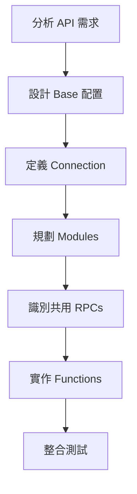

# 應用程式架構

## 本章概要

本章深入探討 Make Custom Apps 的整體架構，幫助您理解應用程式的組成元素、各元件之間的關係，以及如何有效地組織您的應用程式結構。

## 學習目標

- 理解 Make Custom Apps 的整體架構
- 認識主要結構元素（Base、Modules、Connection 等）
- 了解區塊（Blocks）和元件（Components）的概念
- 掌握應用程式的層級關係

## 前置知識

- 已完成「入門指南」章節
- 基本的 JSON 結構知識
- 了解 API 的基本概念

## 內容主體

### 應用程式結構總覽

Make Custom Apps 採用模組化的架構設計，整個應用程式由以下主要元素組成：

```
Custom App
├── Base（基礎設定）
├── Connections（連接）
├── Webhooks（網頁掛鉤）
├── Modules（模組）
├── RPCs（遠端程序呼叫）
└── Functions（函數）
```

### 核心概念：區塊與元件

#### 區塊（Blocks）
區塊是應用程式結構的中層單位。每個結構元素都由多個區塊組成：

- **共用區塊**：在多處出現且用途相同（如 Parameters）
- **專屬區塊**：只在特定位置使用（如 Common Data）

#### 元件（Components）
元件是構成區塊的基本單位，如同建築中的磚塊：

- 區塊必須包含至少一個元件
- 多個元件組合形成一個區塊
- 可透過 `nested` 屬性組合元件

### 主要結構元素詳解

#### 1. Base（基礎設定）

Base 是整個應用程式的基礎配置中心，包含所有模組共用的設定。

**主要功能**：
- 定義基礎 URL
- 設定全域標頭（Headers）
- 管理共用資料（Common Data）
- 配置全域設定

**基本結構**：
```json
{
    "baseUrl": "https://api.example.com",
    "headers": {
        "Content-Type": "application/json",
        "User-Agent": "Make-Custom-App/1.0"
    },
    "common": {
        "apiVersion": "v2",
        "timeout": 30000
    }
}
```

**特點**：
- Base 中不支援 Parameters（參數）
- Common Data 只存在於 Base 和 Connection 中
- 所有模組都會繼承 Base 的設定

#### 2. Connections（連接）

Connection 定義了與外部服務的認證和連接方式。

**支援的認證類型**：
- API Key
- OAuth 2.0
- Basic Authentication
- Custom Authentication

**基本結構**：
```json
{
    "name": "myConnection",
    "label": "My Service Connection",
    "type": "oauth2",
    "common": {
        "baseUrl": "{{common.baseUrl}}"
    }
}
```

#### 3. Modules（模組）

模組是應用程式的核心功能單位，定義了使用者可以執行的操作。

**模組類型**：
- **Action**：執行操作（創建、更新、刪除）
- **Search**：搜尋資料
- **Trigger**：輪詢式觸發器
- **Instant Trigger**：即時觸發器（透過 Webhook）
- **Responder**：回應請求
- **Universal**：通用模組

**模組結構**：
```json
{
    "name": "createRecord",
    "label": "Create a Record",
    "type": "action",
    "typeOptions": {
        "actionType": "create"
    },
    "connection": "myConnection",
    "parameters": [...],
    "interface": [...],
    "communication": {...}
}
```

#### 4. RPCs（Remote Procedure Calls）

RPC 用於動態獲取資料，例如下拉選單的選項。

**用途**：
- 動態載入選項
- 驗證輸入值
- 獲取相關資料

**範例**：
```json
{
    "name": "getProjects",
    "label": "Get Projects",
    "communication": {
        "url": "/projects",
        "method": "GET"
    }
}
```

#### 5. Functions（函數）

Functions 是使用 JavaScript 撰寫的自定義 IML 函數，用於處理複雜的資料轉換和邏輯。

**特點**：
- 使用 JavaScript 語言撰寫
- 在 IML 中透過函數名稱呼叫
- 可以處理複雜的商業邏輯
- 支援除錯和測試

### 元件使用範例

#### 簡單參數配置
當需要固定的輸入欄位時：

```json
[
    {
        "name": "email",
        "label": "Email",
        "type": "email",
        "required": true
    },
    {
        "name": "name",
        "label": "Name",
        "type": "text",
        "required": true
    }
]
```

#### 條件式參數配置
當參數需要根據條件變化時：

```json
[
    {
        "name": "inputType",
        "label": "Input Type",
        "type": "select",
        "options": [
            {
                "label": "Email Input",
                "value": "email",
                "nested": [
                    {
                        "name": "emailAddress",
                        "label": "Email Address",
                        "type": "email"
                    }
                ]
            },
            {
                "label": "Name Input",
                "value": "name",
                "nested": [
                    {
                        "name": "fullName",
                        "label": "Full Name",
                        "type": "text"
                    }
                ]
            }
        ]
    }
]
```

### 應用程式架構最佳實踐

1. **模組化設計**
   - 每個模組應該有單一明確的功能
   - 避免在一個模組中塞入過多功能

2. **重用共用元件**
   - 善用 Base 中的 Common Data
   - 使用 RPC 避免重複程式碼

3. **清晰的命名規範**
   - 使用描述性的名稱
   - 保持命名一致性

4. **錯誤處理**
   - 在每個層級都考慮錯誤情況
   - 提供有意義的錯誤訊息

### 架構設計流程



## 實作練習

### 練習 1：設計應用程式架構
為一個簡單的待辦事項 API 設計應用程式架構：
1. 定義 Base 配置（API URL、共用資料）
2. 設計 Connection（認證方式）
3. 列出需要的 Modules（至少包含：創建、查詢、更新）
4. 識別可能需要的 RPCs

### 練習 2：分析現有應用
選擇一個您熟悉的 Make 內建應用程式，思考：
1. 它可能的架構組成
2. 各模組之間的關係
3. 可能使用的 RPC 功能

## 重點整理

- Make Custom Apps 採用模組化架構，由 Base、Connections、Modules 等元素組成
- 區塊（Blocks）和元件（Components）是組織結構的基本概念
- Base 包含所有模組共用的設定，是應用程式的基礎
- 不同類型的模組適用於不同的使用場景
- 良好的架構設計能提升應用程式的可維護性和擴展性

## 延伸閱讀

- [模組類型詳解](02_模組類型詳解.md) - 深入了解各種模組類型
- [連接與認證實作](../03_開發實戰/02_連接與認證實作.md) - 學習如何實作各種認證方式
- [IML 函數開發](../04_進階功能/01_IML函數開發.md) - 掌握進階的資料處理技巧

---

[← 上一章：開發環境設置](../01_入門指南/03_開發環境設置.md) | [下一章：模組類型詳解 →](02_模組類型詳解.md)