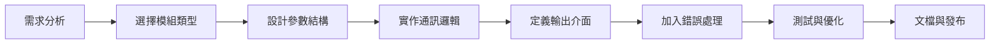

# 模組開發步驟

## 本章概要

本章提供完整的模組開發指南，從需求分析到測試部署的每個步驟。您將學會如何系統化地開發各種類型的模組，並掌握開發過程中的最佳實踐。

## 學習目標

- 掌握模組開發的完整流程
- 了解不同模組類型的開發要點
- 學會設計模組的參數和介面
- 實作複雜的通訊邏輯
- 進行有效的測試和除錯

## 前置知識

- 了解六種模組類型的特性
- 熟悉參數和介面的設計
- 具備基本的 API 整合經驗

## 內容主體

### 模組開發流程總覽



### 步驟 1：需求分析

#### 1.1 識別 API 端點

分析目標 API，回答以下問題：
- 端點的功能是什麼？
- 需要哪些輸入參數？
- 回傳什麼資料？
- 是否需要認證？

#### 1.2 決定模組類型

根據 API 特性選擇適當的模組類型：

| API 特性 | 建議模組類型 |
|---------|-------------|
| 創建/更新/刪除單一資源 | Action |
| 取得多筆資料 | Search |
| 監控新資料 | Trigger |
| 接收即時事件 | Instant Trigger |
| 回應 Webhook | Responder |
| 自訂 API 呼叫 | Universal |

#### 1.3 規劃使用者體驗

- 使用者需要輸入什麼？
- 如何簡化設定流程？
- 哪些參數應該是進階選項？

### 步驟 2：建立模組基礎結構

#### 2.1 在 Make UI 中建立

1. 進入 **Modules** 標籤
2. 點擊 **Add module**
3. 選擇模組類型
4. 填寫基本資訊

#### 2.2 在 VS Code 中建立

右鍵點擊 modules 資料夾，選擇 **New Module**。

#### 2.3 基本配置範例

```json
{
    "name": "createTask",
    "label": "Create a Task",
    "description": "Creates a new task in the project",
    "type": "action",
    "typeOptions": {
        "actionType": "create"
    },
    "connection": "oauth2"
}
```

### 步驟 3：設計參數結構

#### 3.1 參數分類

**靜態參數**（在 parameters 中）：
- 配置選項
- 固定選擇
- 不常變動的設定

**可映射參數**（在 mappable 中）：
- 動態資料
- 從其他模組映射的值
- 使用者輸入的內容

#### 3.2 參數設計範例

```json
{
    "parameters": [
        {
            "name": "projectId",
            "type": "select",
            "label": "Project",
            "required": true,
            "options": {
                "rpc": {
                    "name": "listProjects",
                    "parameters": {}
                }
            }
        },
        {
            "name": "priority",
            "type": "select",
            "label": "Priority",
            "default": "normal",
            "options": [
                {"label": "High", "value": "high"},
                {"label": "Normal", "value": "normal"},
                {"label": "Low", "value": "low"}
            ]
        }
    ],
    "mappable": [
        {
            "name": "title",
            "type": "text",
            "label": "Task Title",
            "required": true,
            "validate": {
                "max": 200,
                "message": "標題不能超過 200 字元"
            }
        },
        {
            "name": "description",
            "type": "text",
            "label": "Description",
            "multiline": true
        },
        {
            "name": "dueDate",
            "type": "date",
            "label": "Due Date",
            "time": true
        }
    ]
}
```

#### 3.3 動態參數

使用 RPC 載入動態選項：

```json
{
    "name": "assignee",
    "type": "select",
    "label": "Assignee",
    "options": {
        "rpc": {
            "name": "listUsers",
            "parameters": {
                "projectId": "{{parameters.projectId}}"
            }
        }
    }
}
```

### 步驟 4：實作通訊邏輯

#### 4.1 基本通訊結構

```json
{
    "url": "/projects/{{parameters.projectId}}/tasks",
    "method": "POST",
    "headers": {
        "Content-Type": "application/json"
    },
    "body": {
        "title": "{{parameters.title}}",
        "description": "{{parameters.description}}",
        "priority": "{{parameters.priority}}",
        "due_date": "{{formatDate(parameters.dueDate, 'YYYY-MM-DD')}}",
        "assignee_id": "{{parameters.assignee}}"
    }
}
```

#### 4.2 條件邏輯

使用 IML 表達式處理複雜邏輯：

```json
{
    "body": {
        "status": "{{if(parameters.dueDate < now, 'overdue', 'pending')}}",
        "tags": "{{if(parameters.tags, parameters.tags, [])}}",
        "notify": "{{if(parameters.priority === 'high', true, false)}}"
    }
}
```

#### 4.3 多步驟請求

某些操作需要多個 API 呼叫：

```json
{
    "temp": {
        "uploadUrl": {
            "url": "/files/upload-url",
            "method": "GET"
        }
    },
    "url": "{{temp.uploadUrl.body.url}}",
    "method": "PUT",
    "body": "{{parameters.fileContent}}"
}
```

### 步驟 5：定義輸出介面

#### 5.1 基本介面定義

```json
{
    "interface": [
        {
            "name": "id",
            "type": "text",
            "label": "Task ID"
        },
        {
            "name": "title",
            "type": "text",
            "label": "Title"
        },
        {
            "name": "status",
            "type": "text",
            "label": "Status"
        },
        {
            "name": "createdAt",
            "type": "date",
            "label": "Created Date"
        }
    ]
}
```

#### 5.2 處理巢狀資料

```json
{
    "interface": [
        {
            "name": "task",
            "type": "collection",
            "label": "Task Details",
            "spec": [
                {
                    "name": "id",
                    "type": "text",
                    "label": "ID"
                },
                {
                    "name": "assignee",
                    "type": "collection",
                    "label": "Assignee",
                    "spec": [
                        {
                            "name": "id",
                            "type": "text",
                            "label": "User ID"
                        },
                        {
                            "name": "name",
                            "type": "text",
                            "label": "Name"
                        }
                    ]
                }
            ]
        }
    ]
}
```

### 步驟 6：Search 模組特殊考量

#### 6.1 實作分頁

```json
{
    "communication": {
        "url": "/tasks",
        "method": "GET",
        "qs": {
            "page": "{{ifempty(parameters.page, 1)}}",
            "limit": "{{parameters.limit}}",
            "search": "{{parameters.query}}"
        },
        "response": {
            "iterate": "{{body.data}}",
            "output": {
                "id": "{{item.id}}",
                "title": "{{item.title}}"
            },
            "pagination": {
                "qs": {
                    "page": "{{body.current_page + 1}}"
                },
                "condition": "{{body.has_more}}"
            }
        }
    }
}
```

#### 6.2 處理篩選條件

```json
{
    "mappable": [
        {
            "name": "filters",
            "type": "filter",
            "label": "Filter",
            "options": {
                "fields": [
                    {
                        "name": "status",
                        "type": "select",
                        "label": "Status",
                        "options": ["active", "completed", "archived"]
                    },
                    {
                        "name": "priority",
                        "type": "select",
                        "label": "Priority",
                        "options": ["high", "normal", "low"]
                    }
                ],
                "operators": [
                    {"label": "equals", "value": "="},
                    {"label": "not equals", "value": "!="}
                ]
            }
        }
    ]
}
```

### 步驟 7：Trigger 模組特殊考量

#### 7.1 Epoch 設定

```json
{
    "epoch": {
        "communication": {
            "url": "/tasks",
            "method": "GET",
            "qs": {
                "limit": 1,
                "order": "created_desc"
            }
        },
        "response": {
            "iterate": "{{body.data}}",
            "output": {
                "id": "{{item.id}}",
                "date": "{{item.created_at}}"
            }
        }
    }
}
```

#### 7.2 處理新項目

```json
{
    "communication": {
        "url": "/tasks",
        "method": "GET",
        "qs": {
            "since": "{{epoch}}",
            "limit": "{{parameters.limit}}"
        },
        "response": {
            "iterate": "{{body.data}}",
            "output": {
                "id": "{{item.id}}",
                "title": "{{item.title}}"
            },
            "trigger": {
                "id": "{{item.id}}",
                "date": "{{item.created_at}}"
            }
        }
    }
}
```

### 步驟 8：錯誤處理

#### 8.1 基本錯誤處理

```json
{
    "response": {
        "error": {
            "type": "{{body.error.type}}",
            "message": "[{{statusCode}}] {{body.error.message}}"
        }
    }
}
```

#### 8.2 條件式錯誤處理

```json
{
    "response": {
        "error": {
            "type": "{{if(statusCode === 401, 'InvalidCredentials', if(statusCode === 429, 'RateLimitError', 'DataError'))}}",
            "message": "{{if(statusCode === 401, '認證失敗', if(statusCode === 429, '請求過於頻繁', body.error))}}"
        }
    }
}
```

### 步驟 9：測試與優化

#### 9.1 單元測試

1. **參數驗證**：測試必填欄位
2. **邊界測試**：測試極限值
3. **錯誤情況**：測試各種錯誤回應

#### 9.2 整合測試

1. **場景測試**：在實際場景中測試
2. **資料映射**：測試參數映射
3. **串接測試**：與其他模組配合

#### 9.3 效能優化

- 減少不必要的 API 呼叫
- 實作適當的快取策略
- 優化分頁大小

### 步驟 10：文檔與範例

#### 10.1 模組說明

提供清晰的 description：
```json
{
    "description": "Creates a new task in the specified project. Supports file attachments and custom fields."
}
```

#### 10.2 參數說明

為每個參數提供 help：
```json
{
    "help": "選擇任務的優先級。高優先級任務會在儀表板中突出顯示。"
}
```

#### 10.3 範例資料

提供 samples 幫助使用者理解：
```json
{
    "samples": {
        "id": "task_123456",
        "title": "完成專案報告",
        "status": "in_progress",
        "priority": "high"
    }
}
```

### 模組開發檢查清單

- [ ] 選擇正確的模組類型
- [ ] 設計清晰的參數結構
- [ ] 實作完整的通訊邏輯
- [ ] 定義適當的輸出介面
- [ ] 加入錯誤處理機制
- [ ] 提供參數驗證
- [ ] 實作分頁（Search/Trigger）
- [ ] 加入說明文字
- [ ] 提供範例資料
- [ ] 完成測試

## 實作練習

### 練習 1：開發 CRUD 模組組
為一個資源開發完整的 CRUD 操作：
- Create（Action）
- Read（Action - Get）
- Update（Action）
- Delete（Action）
- List（Search）

### 練習 2：複雜資料處理
開發一個處理檔案上傳的模組，包含：
- 取得上傳 URL
- 上傳檔案
- 確認上傳狀態

### 練習 3：智慧篩選器
實作一個具有進階篩選功能的 Search 模組。

## 重點整理

- 模組開發是系統化的過程，需要仔細規劃
- 選擇正確的模組類型是成功的關鍵
- 良好的參數設計能提升使用者體驗
- 錯誤處理和測試同樣重要
- 文檔和範例有助於使用者理解

## 延伸閱讀

- [IML 函數開發](../04_進階功能/01_IML函數開發.md) - 處理複雜邏輯
- [錯誤處理與除錯](../04_進階功能/03_錯誤處理與除錯.md) - 深入錯誤處理
- [REST API 整合範例](../05_範例程式/REST_API_整合範例.md) - 完整範例

---

[← 上一章：連接與認證實作](02_連接與認證實作.md) | [返回目錄](../00_目錄索引.md) | [下一章：IML 函數開發 →](../04_進階功能/01_IML函數開發.md)