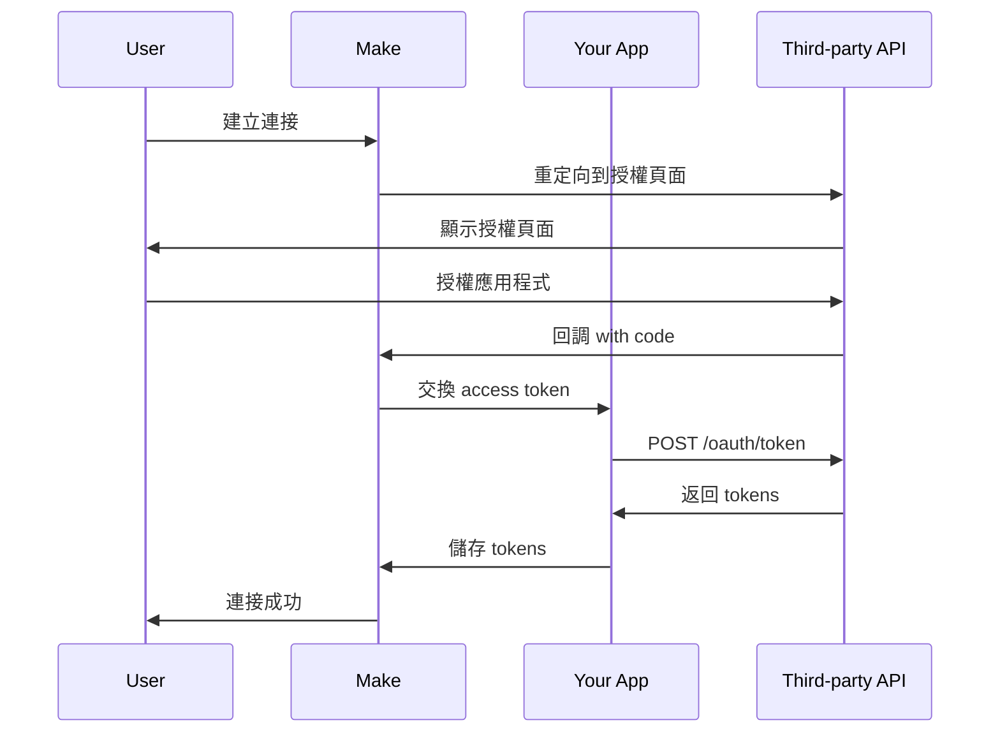

# OAuth 認證範例

## 本章概要

本章提供完整的 OAuth 2.0 認證實作範例，展示如何整合使用 OAuth 認證的第三方服務。我們將以一個社交媒體管理平台為例，實作包含授權流程、token 管理、權限範圍等功能。

## 學習目標

- 實作完整的 OAuth 2.0 授權流程
- 處理 access token 和 refresh token
- 管理權限範圍（scopes）
- 實作 token 自動更新機制
- 處理 OAuth 錯誤情況

## 前置知識

- 了解 OAuth 2.0 授權流程
- 熟悉 HTTP 重定向機制
- 掌握基本的連接（Connection）開發

## 內容主體

### OAuth 2.0 流程概述



### 應用程式架構

```
social-media-manager/
├── app.json
├── base.imljson
├── connections/
│   └── oauth2.imljson         # OAuth 2.0 連接
├── modules/
│   ├── createPost.imljson     # 發布貼文
│   ├── getProfile.imljson     # 取得個人資料
│   ├── listPosts.imljson      # 列出貼文
│   └── uploadMedia.imljson    # 上傳媒體
└── common/
    └── data.imljson           # Client ID/Secret
```

### 步驟 1：設定 Common Data

在發布應用程式前，需要設定 OAuth client 資訊。

#### common/data.imljson

```json
{
    "clientId": "YOUR_CLIENT_ID",
    "clientSecret": "YOUR_CLIENT_SECRET",
    "authorizationUrl": "https://api.socialmedia.com/oauth/authorize",
    "tokenUrl": "https://api.socialmedia.com/oauth/token",
    "scopes": {
        "profile": "讀取個人資料",
        "posts:read": "讀取貼文",
        "posts:write": "發布和編輯貼文",
        "media:upload": "上傳媒體檔案",
        "analytics": "查看分析資料"
    }
}
```

### 步驟 2：OAuth 2.0 連接實作

#### connections/oauth2.imljson

```json
{
    "name": "oauth2",
    "label": "Social Media OAuth Connection",
    "type": "oauth2",
    "help": "連接您的社交媒體帳號以管理貼文和查看分析資料。",
    "scope": [
        {
            "name": "profile",
            "label": "個人資料（必要）"
        },
        {
            "name": "posts:read",
            "label": "讀取貼文"
        },
        {
            "name": "posts:write",
            "label": "發布貼文"
        },
        {
            "name": "media:upload",
            "label": "上傳媒體"
        },
        {
            "name": "analytics",
            "label": "分析資料"
        }
    ],
    "communication": {
        "authorize": {
            "url": "{{common.authorizationUrl}}",
            "qs": {
                "client_id": "{{common.clientId}}",
                "redirect_uri": "{{oauth.redirectUri}}",
                "response_type": "code",
                "scope": "{{join(oauth.scope, ' ')}}",
                "state": "{{oauth.state}}",
                "access_type": "offline"
            }
        },
        "token": {
            "url": "{{common.tokenUrl}}",
            "method": "POST",
            "headers": {
                "Content-Type": "application/x-www-form-urlencoded"
            },
            "body": {
                "client_id": "{{common.clientId}}",
                "client_secret": "{{common.clientSecret}}",
                "code": "{{query.code}}",
                "redirect_uri": "{{oauth.redirectUri}}",
                "grant_type": "authorization_code"
            },
            "response": {
                "data": {
                    "accessToken": "{{body.access_token}}",
                    "refreshToken": "{{body.refresh_token}}",
                    "expiresIn": "{{body.expires_in}}",
                    "tokenType": "{{body.token_type}}",
                    "scope": "{{body.scope}}"
                },
                "error": {
                    "message": "[{{statusCode}}] {{body.error}}: {{body.error_description}}"
                }
            }
        },
        "refresh": {
            "condition": "{{data.refreshToken != null}}",
            "url": "{{common.tokenUrl}}",
            "method": "POST",
            "headers": {
                "Content-Type": "application/x-www-form-urlencoded"
            },
            "body": {
                "client_id": "{{common.clientId}}",
                "client_secret": "{{common.clientSecret}}",
                "refresh_token": "{{data.refreshToken}}",
                "grant_type": "refresh_token"
            },
            "response": {
                "data": {
                    "accessToken": "{{body.access_token}}",
                    "refreshToken": "{{ifempty(body.refresh_token, data.refreshToken)}}",
                    "expiresIn": "{{body.expires_in}}"
                },
                "error": {
                    "message": "Token 更新失敗: {{body.error_description}}"
                }
            }
        },
        "info": {
            "url": "https://api.socialmedia.com/v2/me",
            "headers": {
                "Authorization": "Bearer {{data.accessToken}}"
            },
            "response": {
                "uid": "{{body.id}}",
                "metadata": {
                    "type": "text",
                    "value": "{{body.username}} ({{body.email}})"
                },
                "data": {
                    "userId": "{{body.id}}",
                    "username": "{{body.username}}",
                    "email": "{{body.email}}",
                    "accountType": "{{body.account_type}}"
                },
                "error": {
                    "type": "{{if(statusCode === 401, 'InvalidCredentials', 'ConnectionError')}}",
                    "message": "{{if(statusCode === 401, 'Access token 無效或已過期', body.error.message)}}"
                }
            }
        },
        "invalidate": {
            "url": "https://api.socialmedia.com/v2/oauth/revoke",
            "method": "POST",
            "headers": {
                "Authorization": "Bearer {{data.accessToken}}"
            },
            "body": {
                "token": "{{data.accessToken}}"
            }
        }
    }
}
```

### 步驟 3：Base 配置

#### base.imljson

```json
{
    "baseUrl": "https://api.socialmedia.com/v2",
    "headers": {
        "Authorization": "Bearer {{connection.accessToken}}",
        "Content-Type": "application/json",
        "X-API-Version": "2.0"
    },
    "response": {
        "error": {
            "type": "{{if(statusCode === 401, 'RefreshTokenError', if(statusCode === 403, 'InsufficientScopes', if(statusCode === 429, 'RateLimitError', 'DataError')))}}",
            "message": "[{{statusCode}}] {{body.error.message || body.message || '未知錯誤'}}",
            "code": "{{body.error.code}}"
        }
    },
    "log": {
        "sanitize": [
            "request.headers.Authorization",
            "response.body.access_token",
            "response.body.refresh_token"
        ]
    }
}
```

### 步驟 4：模組實作

#### modules/getProfile.imljson

```json
{
    "name": "getProfile",
    "label": "Get Profile Information",
    "description": "取得已連接帳號的個人資料",
    "type": "action",
    "typeOptions": {
        "actionType": "read"
    },
    "connection": "oauth2",
    "communication": {
        "url": "/me",
        "method": "GET",
        "qs": {
            "fields": "id,username,email,bio,followers_count,following_count,posts_count,verified"
        },
        "response": {
            "output": {
                "id": "{{body.id}}",
                "username": "{{body.username}}",
                "email": "{{body.email}}",
                "bio": "{{body.bio}}",
                "followersCount": "{{body.followers_count}}",
                "followingCount": "{{body.following_count}}",
                "postsCount": "{{body.posts_count}}",
                "verified": "{{body.verified}}",
                "profileUrl": "{{body.profile_url}}"
            }
        }
    },
    "interface": [
        {
            "name": "id",
            "type": "text",
            "label": "User ID"
        },
        {
            "name": "username",
            "type": "text",
            "label": "Username"
        },
        {
            "name": "email",
            "type": "email",
            "label": "Email"
        },
        {
            "name": "bio",
            "type": "text",
            "label": "Bio"
        },
        {
            "name": "followersCount",
            "type": "number",
            "label": "Followers"
        },
        {
            "name": "followingCount",
            "type": "number",
            "label": "Following"
        },
        {
            "name": "postsCount",
            "type": "number",
            "label": "Posts"
        },
        {
            "name": "verified",
            "type": "boolean",
            "label": "Verified"
        },
        {
            "name": "profileUrl",
            "type": "url",
            "label": "Profile URL"
        }
    ]
}
```

#### modules/createPost.imljson

```json
{
    "name": "createPost",
    "label": "Create a Post",
    "description": "發布新貼文到社交媒體",
    "type": "action",
    "typeOptions": {
        "actionType": "create"
    },
    "connection": "oauth2",
    "scope": ["posts:write"],
    "parameters": [
        {
            "name": "postType",
            "type": "select",
            "label": "Post Type",
            "default": "text",
            "options": [
                {
                    "label": "文字貼文",
                    "value": "text"
                },
                {
                    "label": "圖片貼文",
                    "value": "image"
                },
                {
                    "label": "影片貼文",
                    "value": "video"
                }
            ]
        }
    ],
    "mappable": [
        {
            "name": "content",
            "type": "text",
            "label": "Content",
            "required": true,
            "multiline": true,
            "validate": {
                "max": 280,
                "message": "內容不能超過 280 字元"
            }
        },
        {
            "name": "mediaIds",
            "type": "array",
            "label": "Media IDs",
            "help": "使用 Upload Media 模組上傳的媒體 ID",
            "spec": {
                "type": "text"
            },
            "validate": {
                "max": 4,
                "message": "最多只能附加 4 個媒體檔案"
            }
        },
        {
            "name": "visibility",
            "type": "select",
            "label": "Visibility",
            "default": "public",
            "options": [
                {
                    "label": "公開",
                    "value": "public"
                },
                {
                    "label": "僅限追蹤者",
                    "value": "followers"
                },
                {
                    "label": "私人",
                    "value": "private"
                }
            ]
        },
        {
            "name": "scheduledAt",
            "type": "date",
            "label": "Schedule Post",
            "help": "留空立即發布，或選擇未來時間排程發布",
            "time": true
        }
    ],
    "communication": {
        "url": "/posts",
        "method": "POST",
        "body": {
            "type": "{{parameters.postType}}",
            "content": "{{parameters.content}}",
            "media_ids": "{{parameters.mediaIds}}",
            "visibility": "{{parameters.visibility}}",
            "scheduled_at": "{{if(parameters.scheduledAt, formatDate(parameters.scheduledAt, 'YYYY-MM-DD HH:mm:ss'), null)}}"
        },
        "response": {
            "output": {
                "id": "{{body.id}}",
                "url": "{{body.url}}",
                "content": "{{body.content}}",
                "type": "{{body.type}}",
                "visibility": "{{body.visibility}}",
                "createdAt": "{{parseDate(body.created_at, 'YYYY-MM-DD HH:mm:ss')}}",
                "scheduledAt": "{{if(body.scheduled_at, parseDate(body.scheduled_at, 'YYYY-MM-DD HH:mm:ss'), null)}}",
                "status": "{{body.status}}"
            }
        }
    },
    "interface": [
        {
            "name": "id",
            "type": "text",
            "label": "Post ID"
        },
        {
            "name": "url",
            "type": "url",
            "label": "Post URL"
        },
        {
            "name": "content",
            "type": "text",
            "label": "Content"
        },
        {
            "name": "type",
            "type": "text",
            "label": "Type"
        },
        {
            "name": "visibility",
            "type": "text",
            "label": "Visibility"
        },
        {
            "name": "createdAt",
            "type": "date",
            "label": "Created Date"
        },
        {
            "name": "scheduledAt",
            "type": "date",
            "label": "Scheduled Date"
        },
        {
            "name": "status",
            "type": "text",
            "label": "Status"
        }
    ]
}
```

#### modules/uploadMedia.imljson

```json
{
    "name": "uploadMedia",
    "label": "Upload Media",
    "description": "上傳圖片或影片以用於貼文",
    "type": "action",
    "typeOptions": {
        "actionType": "create"
    },
    "connection": "oauth2",
    "scope": ["media:upload"],
    "mappable": [
        {
            "name": "file",
            "type": "buffer",
            "label": "Media File",
            "required": true,
            "help": "支援 JPG、PNG、GIF（圖片）和 MP4（影片）"
        },
        {
            "name": "type",
            "type": "select",
            "label": "Media Type",
            "required": true,
            "options": [
                {
                    "label": "Image",
                    "value": "image"
                },
                {
                    "label": "Video",
                    "value": "video"
                }
            ]
        },
        {
            "name": "description",
            "type": "text",
            "label": "Alt Text / Description",
            "help": "為無障礙使用提供描述"
        }
    ],
    "communication": {
        "temp": {
            "uploadUrl": {
                "url": "/media/upload/init",
                "method": "POST",
                "body": {
                    "type": "{{parameters.type}}",
                    "size": "{{length(parameters.file)}}"
                }
            }
        },
        "url": "{{temp.uploadUrl.body.upload_url}}",
        "method": "PUT",
        "headers": {
            "Content-Type": "{{if(parameters.type === 'image', 'image/jpeg', 'video/mp4')}}",
            "Content-Length": "{{length(parameters.file)}}"
        },
        "body": "{{parameters.file}}",
        "response": {
            "output": {
                "mediaId": "{{headers['x-media-id']}}",
                "type": "{{parameters.type}}",
                "size": "{{length(parameters.file)}}",
                "url": "{{headers['x-media-url']}}",
                "thumbnailUrl": "{{headers['x-thumbnail-url']}}"
            }
        }
    },
    "interface": [
        {
            "name": "mediaId",
            "type": "text",
            "label": "Media ID"
        },
        {
            "name": "type",
            "type": "text",
            "label": "Type"
        },
        {
            "name": "size",
            "type": "number",
            "label": "File Size"
        },
        {
            "name": "url",
            "type": "url",
            "label": "Media URL"
        },
        {
            "name": "thumbnailUrl",
            "type": "url",
            "label": "Thumbnail URL"
        }
    ]
}
```

### 步驟 5：處理權限範圍

當模組需要特定權限時，可以在模組中定義所需的 scope：

```json
{
    "name": "getAnalytics",
    "label": "Get Analytics",
    "connection": "oauth2",
    "scope": ["analytics"],
    "communication": {
        // ...
    }
}
```

如果使用者的連接缺少必要權限，Make 會提示使用者重新授權。

### 步驟 6：錯誤處理

#### 處理 Token 過期

當 access token 過期時，Make 會自動使用 refresh token 更新：

```json
{
    "response": {
        "error": {
            "type": "{{if(statusCode === 401 && body.error === 'token_expired', 'RefreshTokenError', 'DataError')}}",
            "message": "{{body.error_description}}"
        }
    }
}
```

#### 處理權限不足

```json
{
    "response": {
        "error": {
            "type": "InsufficientScopes",
            "message": "此操作需要額外權限: {{body.required_scope}}"
        }
    }
}
```

### 最佳實踐

1. **權限最小化**
   - 只請求必要的權限
   - 在模組層級定義所需權限
   - 提供清晰的權限說明

2. **Token 管理**
   - 實作 refresh token 機制
   - 安全儲存 token
   - 定期檢查 token 有效性

3. **錯誤處理**
   - 區分 token 錯誤和其他錯誤
   - 提供有意義的錯誤訊息
   - 實作適當的重試機制

4. **使用者體驗**
   - 清晰說明每個權限的用途
   - 在連接時顯示帳號資訊
   - 支援連接撤銷

5. **安全性**
   - 使用 HTTPS
   - 驗證 state 參數
   - 清理日誌中的敏感資訊

### 測試 OAuth 流程

1. **本地測試**
   ```json
   {
       "oauth": {
           "redirectUri": "http://localhost:8080/oauth/callback"
       }
   }
   ```

2. **生產環境**
   ```
   https://www.make.com/oauth/cb/app
   ```

3. **測試檢查清單**
   - [ ] 授權流程順暢
   - [ ] Token 正確儲存
   - [ ] Refresh token 自動更新
   - [ ] 權限範圍正確
   - [ ] 錯誤處理完善

## 實作練習

### 練習 1：實作 OAuth 1.0
將範例改為 OAuth 1.0 認證（如 Twitter API）。

### 練習 2：多帳號支援
實作支援多個社交媒體帳號的切換功能。

### 練習 3：Token 管理介面
建立模組顯示 token 資訊和權限狀態。

## 重點整理

- OAuth 2.0 提供安全的第三方認證
- Common Data 儲存 client 資訊
- 自動處理 token 更新
- 權限範圍提供細緻的存取控制
- 良好的錯誤處理提升使用者體驗

## 延伸閱讀

- [連接與認證實作](../03_開發實戰/02_連接與認證實作.md) - 認證基礎概念
- [複雜資料處理範例](複雜資料處理範例.md) - 處理 OAuth 回應資料
- [常見問題集](../06_參考資料/常見問題集.md) - OAuth 常見問題

---

[← 上一章：REST API 整合範例](REST_API_整合範例.md) | [下一章：複雜資料處理範例 →](複雜資料處理範例.md)